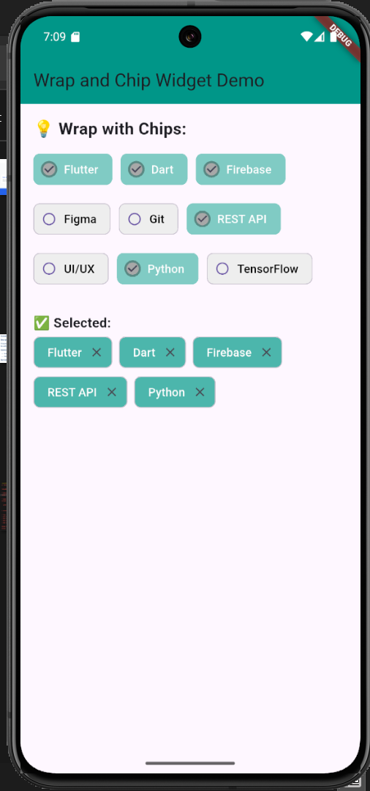

# Wrap_chip_demo_presentation
This simple Flutter demo showcasing the use of `Wrap` and `Chip` widgets to create a responsive layout of selectable tags.

---
## Initialization

### 1 Clone the repository:
  ```bash
    git clone https://github.com/e-dania/Wrap_chip_demo_presentation
cd Wrap_chip_demo_presentation
```
### 2 Install the packages
  ```bash
flutter pub get
```

### 3 Run the app
  ```bash
flutter run
```

---
## Widget Explanation
The wrap widget arranges children widgets horizontally and wraps to the next line if needed.
The chip widget displays a compact, rounded UI element that has multiple different styles and choices

---
## Screenshots


